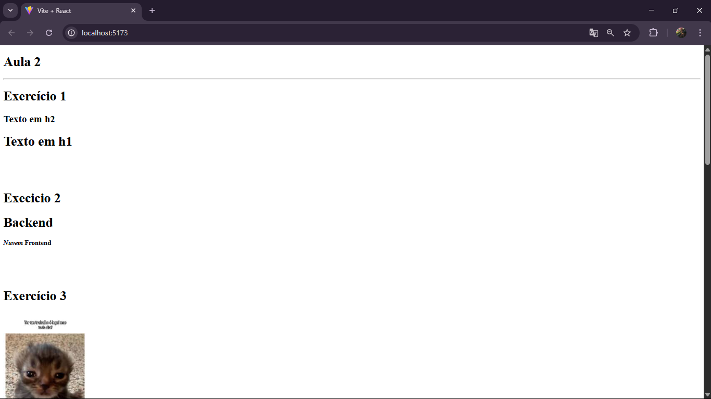

## Hook

* Hooks são como ferramentas especiais que você pode usar dentro dos seus componentes.

* Eles servem para guardar informações, reagir a mudanças como mudanças de estado, e tambem lembrar valores ou funções

* O hook sempre começa com useState para gerenciar o  estado das coisas

* Só podem ser usados dentro de componentes ou de outros hooks.


## HookContador

 Aqui e usado const [contador, setContador] = useState( 1 ) para mudar o estado do numero, sendo o a variavel contador para armazenar o valor e setContador para mudar esse valor.


## HookMegaSena

Aqui ele funciona como explicado a cima, mas possui algumas coisas a mais:

```
function sortearNumero() {
  if (sorteados.length < 6) {
    let numeroSorteado = Math.floor(Math.random() * 60) + 1

    setSorteado(numeroSorteado)
    setSorteados([...sorteados, numeroSorteado])
  } else {
    alert("Já temos 6 números sorteados");
  }
}
```

Aqui acima o codigo verifica se ainda foram sorteados menos de 6 números, gerando um número aleatório entre 1 e 60 e atualizando o número sorteado (sorteado), ai ele adiciona esse número à lista (sorteados) usando ...sorteados (spread operator).

```
 function sortearNumero() {
        if (sorteados.length < 5) {

            let numeroSorteado = Math.floor(Math.random() * 80) + 1

            setSorteado(numeroSorteado)
            setSorteados([...sorteados, numeroSorteado])

        } else {
            alert("Você ja tem 5 úmeros sortedos");
        }
```

Já o da Quina faz a mesma coisa, a única diferença é o limite de 5 números e o intervalo de sorteio (1 a 80).



