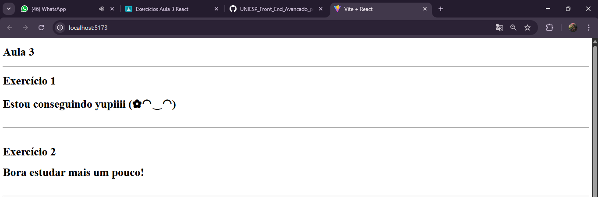
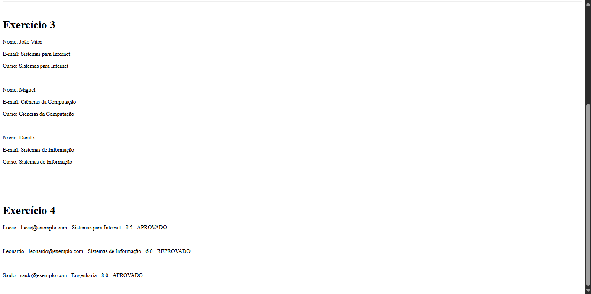

## Components:

* O componente aluno.jsx exibe as informações de um aluno, recebidas como props: nome, email e senha.

* O componente EstacomSono.jsx recebe um prop chamado comSono, podendo exibir 2 mensagens diferentes: Se comSono for true e exibido: "Hora de descansar", se comSono for false e exibido: "Bora estudar mais um pouco!".

* O componente EstouConseguindoAprenderReact.jsx mostra uma mensagem com base no prop estouConseguindo sendo eles: Se for true, exibe "Estou conseguindo yupiiiii (✿◠‿◠)" ou Se for false, exibe "Preciso estudar mais".

* Já o componente NovoAluno.jsx mostra os dados de um aluno junto com sua média, atraves dos props nome, email, curso, media, se a media for maior que 7 e aprovado, se for menor e reprovado

## Imagens da atividade

