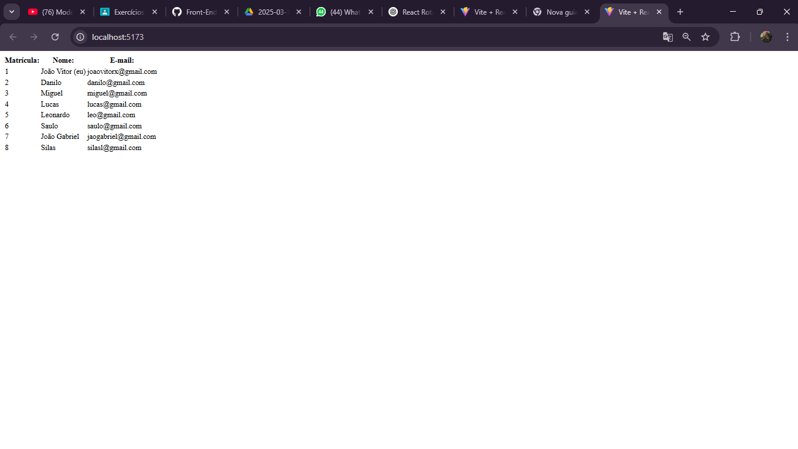

## NPM

1. Primeiro, execute o comando npm create para criar a pasta do projeto.

2. Depois de criar a pasta, é necessário instalar o Vite com o comando: npm install vite@latest.

3. Também instale o servidor e o axios usando: npm install json-server e npm install axios.

## useEffect

* O useEffect busca dados de APIs, ele é executado só uma vez quando o componente carrega e serve tambem para atualizar algo quando uma variável (estado ou prop) muda.

## ListaDeAlunos

* Aqui é criado o estado alunos, que começa vazio onde para ser alterado e usado o setAlunos. O useEffect roda só uma vez, quando o componente carrega, então ele faz uma requisição GET usando o fetch() para buscar os dados,

## db.json

* O db.json  utemma tabela de alunos, puxando os dados de um "banco de dados" falso (simulado pelo json-server). Ele tem dois arquivos principais:

* ListaDeAlunos.jsx é um componente React que busca os dados dos alunos.

* App.jsx é o componente principal que exibe a ListaDeAlunos.

* O localhost:3000/alunos vem de um arquivo db.json que simula um banco de dados.

