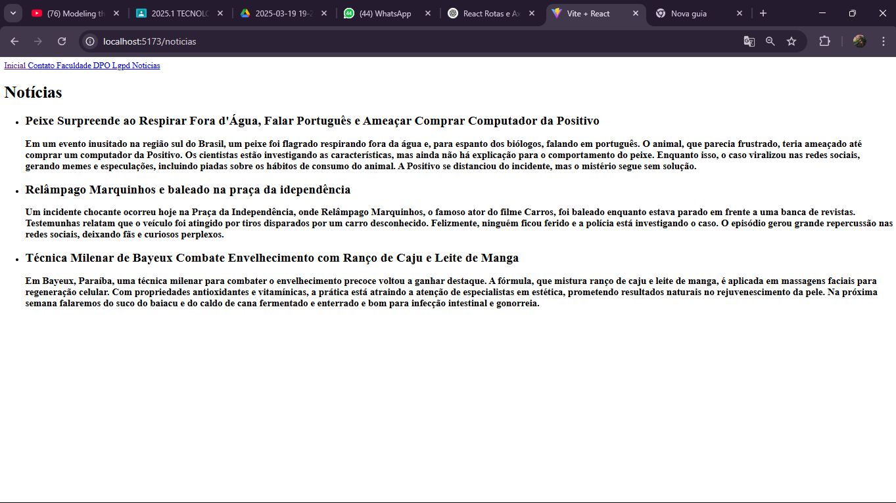
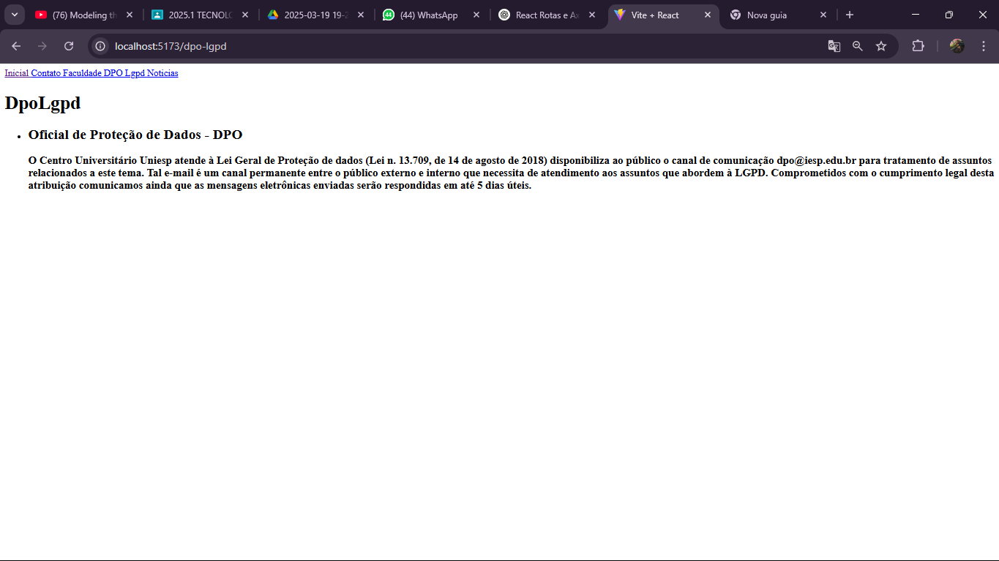

## NPM

1. Primeiro, execute o comando npm create para criar a pasta do projeto.

2. Depois de criar a pasta, é necessário instalar o Vite com o comando: npm install vite@latest.

3. Também instale o servidor e o axios usando: npm install json-server e npm install axios.

## Axios

 * O axios é uma biblioteca JavaScript usada para fazer requisições HTTP.

 * Com axios você pode fazer requisiçoes HTTP como:

1. GET: buscar dados

2. POST: enviar dados

3. PUT ou PATCH: atualizar dados

4. DELETE: remover dados

## Hooks

* O código também usa Hooks, como useState e useEffect. Eles servem pra controlar e atualizar o estado das variáveis e fazer algo quando o componente carrega, por exemplo. 

## db.json

* O db.json que fica dentro da pasta data atua como um banco de dados "falso" lendo requests como GET, POST, PUT PATCH e DELETE. 

* O localhost:3000/alunos vem de um arquivo db.json que simula um banco de dados.

* Resumindo ele simula uma API real sem precisar de backend.

## Components:

* No componente Noticias.jsx e feito ua requisição para o endereço http://localhost:3000/noticias que é feito com o npm server, ai se der certo, os dados são salvos no estado noticias com SetNoticias. O componente Dpol faz as mesmas coisas.

