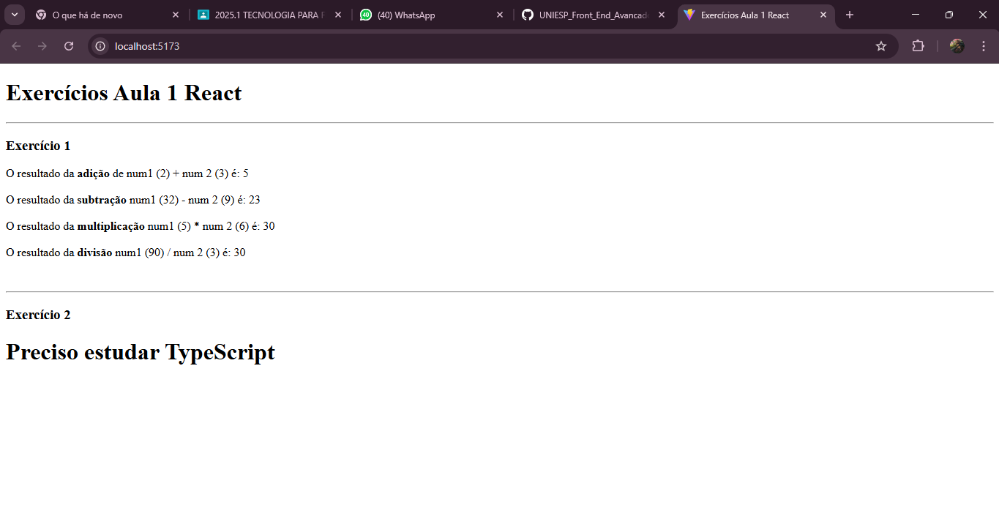

## Como configurar:

1. Instale o Node.js (caso ainda não tenha)

2. Instale as dependências:

   npm install
   

3. Inicie o servidor de desenvolvimento:

   npm run dev
   

4. Abra no navegador:

   http://localhost:

## Ferramentas e extensões que podem ajudar

* ES7+ React/Redux/React-Native snippets (atalhos para código React)

## O programa possui 7 arquivos principais:

1. Adicao.jsx
2. Divisao.jsx
3. Multiplicacao.jsx
4. Subtracao.jsx
5. PrecisoEstudar.jsx
6. App.jsx
7. main.jsx

## Explicando as classes:

* Todos os componentes com nomes de operações matematicas recebem dois números (num1 e num2) como props (propriedades). Eles fazem a operação matemática e mostram o resultado na tela.

* O componente PrecisoEstudar.jsx simplesmente recebe uma string (nomeDaTecnologia) e exibe na tela.

* O App.jsx junta tudo e os exibe na tela. Ele chama os componentes e passa valores para eles através das props.

* No index é onde o React monta a aplicação dentro do HTML. O createRoot pega o elemento com id="root" e renderiza o <App /> dentro dele.

